# next-tailwind-css

O objetivo é  aprender <a href="https://nextjs.org/" target="_blank">Next.js</a>, <a href="https://next-auth.js.org/" target="_blank">NextAuth.js</a> , <a href="https://tailwindui.com/" target="_blank">Tailwind CSS</a>, <a href="https://www.prisma.io/" target="_blank">Prisma</a>.

|Login |Home| Products| Product | Modal |
|-------|-------|------|------|------|
|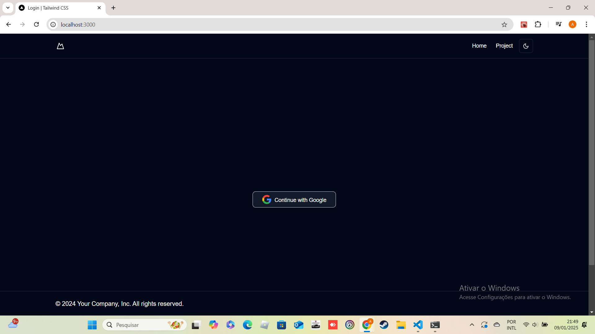|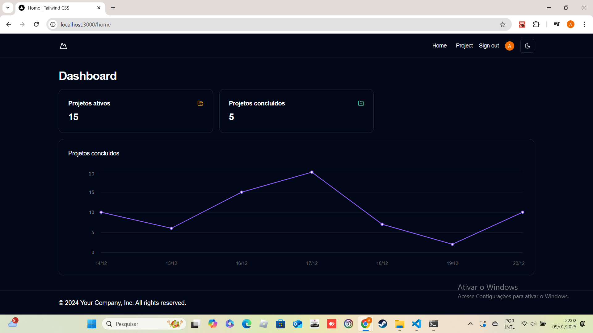|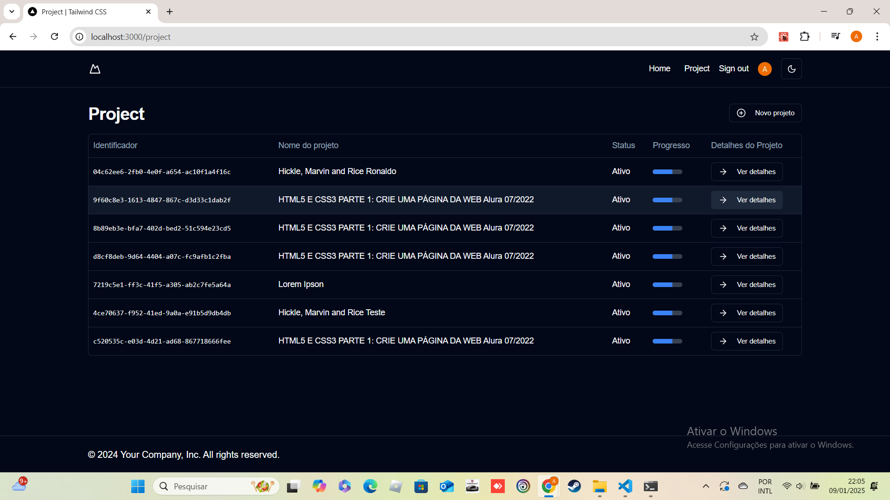|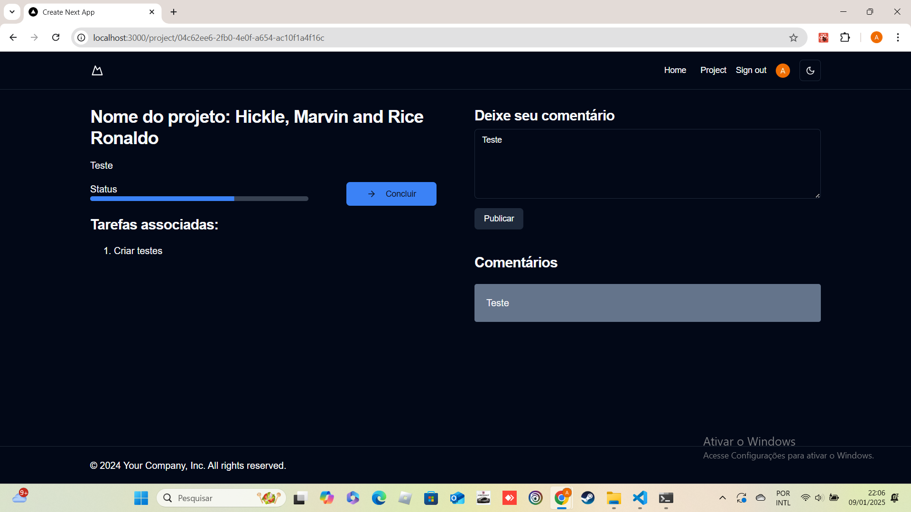|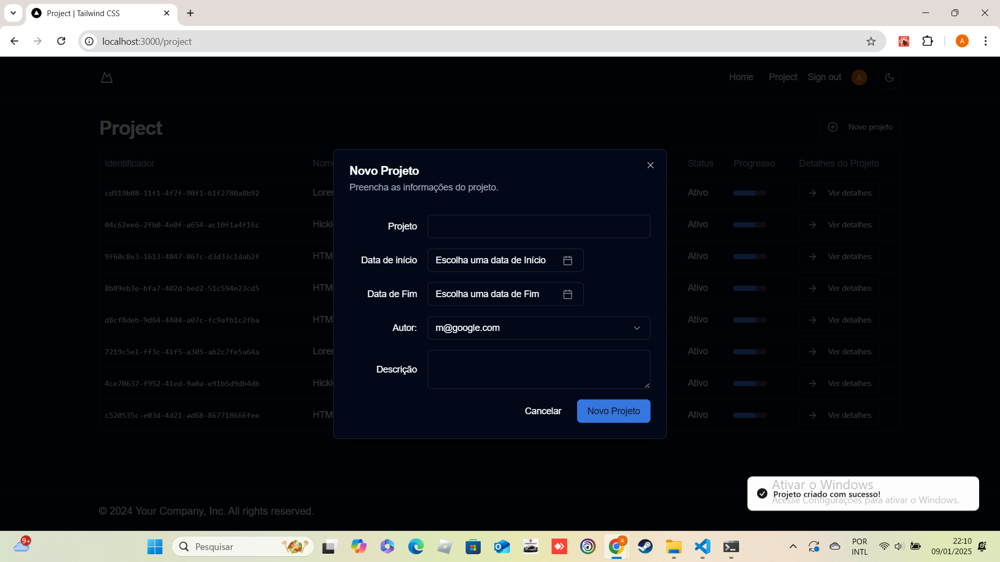|

## Responsivo 

|Login |Home| Products| Product | Modal |
|-------|-------|------|------|------|
|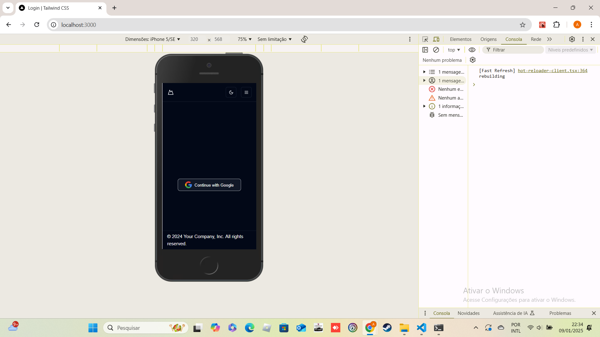|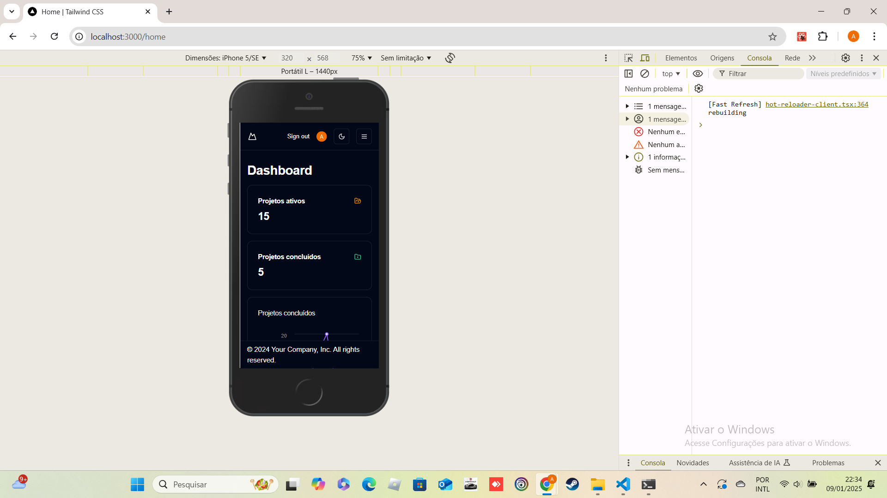|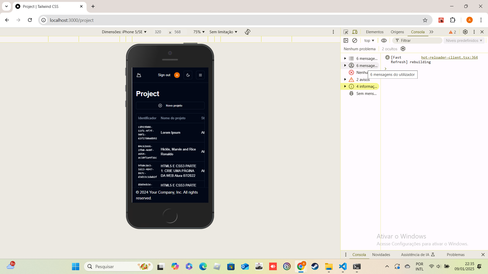|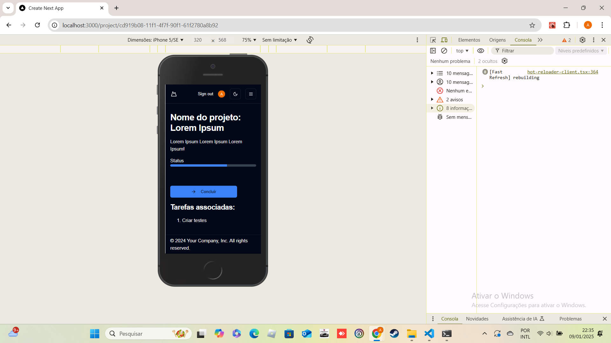|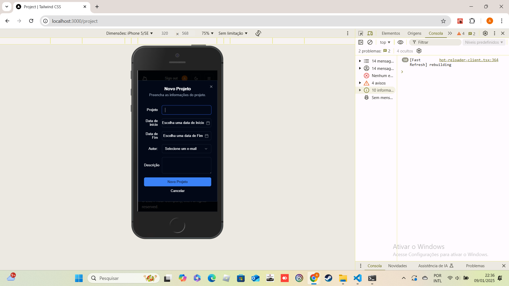|

## Prisma studio 

`npx prisma studio`

|Users |
|-------|
|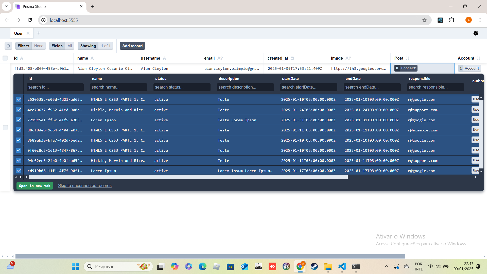|

## ✔️ Técnicas e tecnologias utilizadas

Lista das bibliotecas utilizadas no desenvolvimento:

- `@hookform/error-message`
- `@hookform/resolvers`
- `@prisma/client`
- `@radix-ui/react-dialog`
- `@radix-ui/react-dropdown-menu`
- `@radix-ui/react-label`
- `@radix-ui/react-navigation-menu`
- `@radix-ui/react-popover`
- `@radix-ui/react-progress`
- `@radix-ui/react-select`
- `@radix-ui/react-slot`
- `@radix-ui/react-toast`
- `axios`
- `class-variance-authority`
- `clsx`
- `date-fns`
- `lucide-react`
- `next`
- `next-auth`
- `next-themes`
- `react`
- `react-day-picker`
- `react-dom`
- `react-hook-form`
- `recharts`
- `sonner`
- `tailwind-merge`
- `tailwindcss-animate`
- `zod`


## 🛠️ Abrir e rodar o projeto

### Necessário criar .env

```bash
GOOGLE_CLIENT_ID=""
GOOGLE_CLIENT_SECRET=""

NEXTAUTH_SECRET="02iatz1+y24y8zR4DslozmJaaBFcqfXOps7DfYOtaTY="
NEXTAUTH_URL="http://localhost:3000/"

# This was inserted by `prisma init`:
# Environment variables declared in this file are automatically made available to Prisma.
# See the documentation for more detail: https://pris.ly/d/prisma-schema#accessing-environment-variables-from-the-schema

# Prisma supports the native connection string format for PostgreSQL, MySQL, SQLite, SQL Server, MongoDB and CockroachDB.
# See the documentation for all the connection string options: https://pris.ly/d/connection-strings

DATABASE_URL="file:./dev.db"
```

Dentro da pasta do projeto execute npm i ou yarn para instalar as dependências, é necessário criar um aplicativo no  <a href="https://console.developers.google.com/apis/credentials" target="_blank">Google cloud</a> para obter as credentials, adiciona a .env na raiz do projeto , adicionar as chaves de GOOGLE_CLIENT_ID e GOOGLE_CLIENT_SECRET salvar o arquivo e para  rodar a aplicação é necessário abrir o terminal na pasta do projeto e digitar os comandos npm run dev  ou yarn dev.